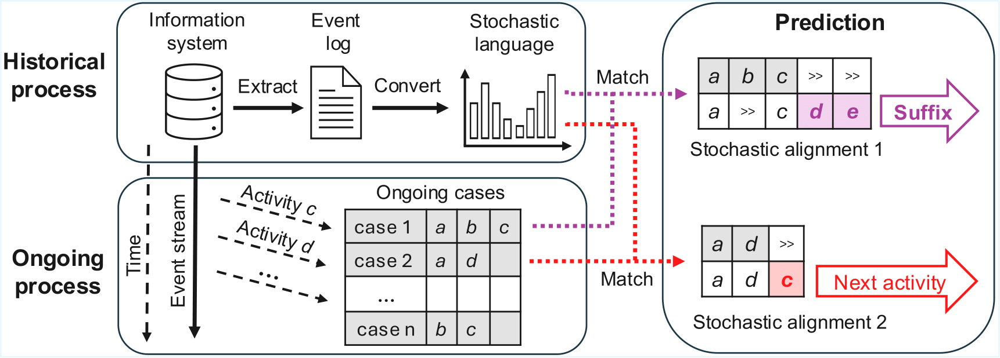

# Explainable Predictive Process Monitoring with Stochastic Alignments
This repository provides the implementation details and supplementary materials to support the findings presented in the paper "Explainable Predictive Process Monitoring with Stochastic Alignments".

# Part 1. Stochastic Alignments
We treat the stochastic language induced by historical process executions as the underlying representation of the proces. The stochastic alignments are computed using a stochastic cost function controlled by a balance parameter α (range from 0 to 1). Once the an alignment is computed, we identify the next activity and suffix using projection. The following figure illustrate the overview of our technique.



The key intuition is that alignments classify discrepancies between observed and historical behavior: log moves are identified as deviations from the expected process, while model moves represent missing behavior that should have occurred but did not in the prefix. The position of the last synchronous move corresponds to the last point where the observed prefix and the trace agree. From this anchor point, the subsequent model move represents the next predicted activity, and the remaining model moves thereafter are projected onto a sequence of activities that collectively form the suffix.

We first present the results of best balance parameter α for the event logs used in evaluation. This is computed by iteratively compute best accuracy or Damerau-Levenshtein Similarity (DLS) using α from 0 to 1.

| Event log | Next activity prediction| Suffix prediction | Time to determine α (seconds)|
|    :----   | :----:   |          :---: | ---: |
|Helpdesk|α=0.73|α=0.73|4.76|
|Sepsis|α=0.78|α=0.93|247.31|
|BPIC12|α=0.98|α=0.98|1|1230.19|
|BPIC13_close|α=0.89|α=0.96|2.43|
|BPIC13_incident|α=0.71|α=0.71|16.68|
|BPIC17_offer|α=0.60|α=0.60|0.46|
|BPIC20_domestic|α=0.64|α=0.48|1.26|
|BPIC20_international|α=0.50|α=0.43|69.27|
|BPIC20_prepaid|α=0.52|α=0.52|16.67|
|BPIC20_request|α=0.61|α=0.50|1.43|

## Dataset
**\dataset** folder contains the event logs used in this study. The event logs were sorted by time and chronologically divided, with the first 80% of the traces used as the training set and the remaining 20% as the test set.  The table below illustrates the characteristics of event logs used in evaluation.

| Event log | Events | Cases | Trace variants | Activities | Min/Max/Avg. trace length |
|:-----|--------:|-------:|----------------:|------:|---------------------------|
| BPIC12 | 262,200 | 13,087 | 4,366 | 24 | 3/175/20.04 |
| BPIC13_Close | 6,660 | 1,487 | 327 | 7 | 1/35/4.48 |
| BPIC13_Incident | 65,533 | 7,554 | 2,278 | 13 | 1/123/8.68 |
| BPIC17_Offer | 193,849 | 42,995 | 16 | 8 | 3/5/4.51 |
| BPIC20_Request | 36,796 | 6,886 | 89 | 19 | 1/20/5.34 |
| BPIC20_Domestic | 56,437 | 10,500 | 99 | 17 | 1/24/5.37 |
| BPIC20_Prepaid | 18,246 | 2,099 | 202 | 29 | 1/21/8.69 |
| BPIC20_International | 72,151 | 6,449 | 753 | 34 | 3/27/11.19 |
| Helpdesk | 21,348 | 4,580 | 226 | 14 | 2/15/4.66 |
| Sepsis | 15,214 | 1,050 | 846 | 16 | 3/185/14.49 |

## Run experiments
The prediction technique can be used as a standalone tool from the command line. 
### Single trace prediction
To predict the next activity of a prefix <Insert ticket, Assign seriousness, Take in charge ticket>, run the following command:
```
cargo run prediction pretra ./testlogs/helpdesk_80.xes "Insert ticket"
"Assign seriousness" "Take in charge ticket"
```

To predict the next activity of a prefix <Insert ticket, Assign seriousness, Take in charge ticket>, run the following command:
```
cargo run prediction presfx ./testlogs/helpdesk_80.xes "Insert ticket"
"Assign seriousness" "Take in charge ticket"
```

### Prediction experiments
To evaluate the performance of next activity prediction, run the following command:
 ```
cargo run prediction prenext ./testlogs/helpdesk_80.xes ./testlogs/helpdesk_20.xes
 ```

To evaluate the performance of suffix prediction, run the following command:
 ```
cargo run prediction presfx ./testlogs/helpdesk_80.xes ./testlogs/helpdesk_20.xes
 ```


# Part 2. Other Prediction Techniques
The following table lists all prediction techniques used for evaluation.

| Name | Prediction task | Link |
|    :----   | :----   |          :---: | 
| LSTM   |  Next activity|  [Paper](https://link.springer.com/chapter/10.1007/978-3-319-59536-8_30), [Code](https://github.com/verenich/ProcessSequencePrediction?tab=readme-ov-file)  |
| ImagePP-Miner| Next activity|[Paper](https://ieeexplore.ieee.org/document/8786066), [Code](https://github.com/vinspdb/ImagePPMiner)|
|ProcessTransformer | Next activity|[Paper](https://arxiv.org/abs/2104.00721), [Code](https://github.com/Zaharah/processtransformer.) |      
|SEPHIGRAPH|Next activity|[Paper](https://link.springer.com/chapter/10.1007/978-3-031-92474-3_22), [Code](https://github.com/sebdisdv/SEPHIGRAPH)|
|ProcesspredictR|Next activity|[Paper](https://ceur-ws.org/Vol-3648/paper_972.pdf), [Code](https://bupaverse.github.io/docs/predict_workflow.html)|
|Transition system|Suffix|[Paper](), [Code]()|
|SuTraN|Suffix|[Paper](), [Code]()|
|CRTP-LSTM|Suffix|[Paper](), [Code]()|
|ASTON|Suffix|[Paper](), [Code]()|
|DOGE|Suffix|[Paper](), [Code]()|

Note that we sort the traces in event log by time and chronologically divided, with the first 80% of the traces used as the training set and the remaining 20% as the test set. We keep the same hyperparamters settings as original paper. 

## Run experiments
### ProcesspredictR
To run next activity prediction using ProcesspredictR, first install R and RStudio following the [tutorial](https://rstudio-education.github.io/hopr/starting.html). Then, install BupaR to use processpredictR following the [tutorial](https://bupaverse.github.io/docs/install.html). The code below is adapted based on prediction workflow from [Bupar](https://bupaverse.github.io/docs/predict_workflow.html). To run the event log split and further experiments in RStudio, change 'bpi17_offer.xes' into your event log for function read_xes in line 6:
```
library(tensorflow)
library(xesreadR)
library(processpredictR)
library(bupaverse)
library(dplyr)
data <- read_xes("logs/bpi17_offer.xes")
df <- prepare_examples(data, task = "next_activity")
df$start_time <- as.POSIXct(df$start_time)

# Sort by start_time in ascending order
df <- df[order(df$start_time)]

# Split into train and test (e.g., 80% train, 20% test)
split_index <- floor(0.8 * nrow(df))
train_df <- df[1:split_index, ]
test_df <- df[(split_index + 1):nrow(df), ]

# Start training
model <- train_df %>% create_model(name = "my_model") 
model %>% compile() # model compilation
hist <- fit(object = model, train_data = train_df, epochs = 5)
predictions <- model %>% predict(test_data = test_df, output = "append")

# Returns loss and metrics
model %>% evaluate(test_df)
```
## Transition system
For transition system-based suffix prediction, run the experiments with the following command:
```
 python3 beam_search.py --training_log training_log --test_log test_log
```
For instance:
```
 python3 beam_search.py --training_log data/domestic_80.csv --test_log data/domestic_20.csv 
```

# Other techniques
For other prediction techniques, we refer you to the code in their original code repositories.

# Part 3. Evaluation results
The accuracy of next activity prediction is shown in the following table.
| Event log | Our technique | LSTM | ImagePP-Miner| Process-transformer | SEPHIGRAPH | process-predictR |
|:-----|:-:|:-:|:-:|:-:|:-:|:-:|
| BPIC12 | 0.515 | 0.852| 0.836 | 0.848 | 0.739 | 0.843 |
| BPIC13_Close | 0.764| 0.576 | 0.244 | 0.584 | 0.395 | 0.673 |
| BPIC13_Incident | 0.669 | 0.672| 0.352 | 0.638 | 0.487 | 0.701 |
| BPIC17_Offer | 0.826 | 0.852 | 0.808 | 0.853| 0.739 | 0.853|
| BPIC20_Domestic | 0.873 | 0.907| 0.907| 0.906 | 0.878 | 0.907|
| BPIC20_International | 0.759 | 0.898| 0.887 | 0.898| 0.697 | 0.891 |
| BPIC20_Prepaid | 0.774 | 0.857| 0.838 | 0.856 | 0.699 | 0.850 |
| BPIC20_Request | 0.874 | 0.891 | 0.894| 0.892 | 0.880 | 0.892 |
| Helpdesk | 0.713| 0.712 | 0.684 | 0.703 | 0.666 | 0.702 |
| Sepsis | 0.335 | 0.656| 0.574 | 0.631 | 0.320 | 0.520 |
| **Average accuracy** | 0.712 | 0.787| 0.712 | 0.782 | 0.650 | 0.783 |

The Damerau-Levenshtein Similarity (DLS) of suffix prediction is shown in the following table.
| Event log | Our technique | Transition system| SuTraN | CRTP-LSTM | ASTON | DOGE|
|:-----|:-:|:-:|:-:|:-:|:-:|:-:|
| BPIC12 | 0.469 | 0.467 | 0.143 | 0.235 | 0.403 | 0.336 |
| BPIC13_Close | 0.835 | 0.734 | 0.839 | 0.548 | 0.654 | 0.714 |
| BPIC13_Incident | 0.664 | 0.564 | 0.451 | 0.633 | 0.667 | 0.650 |
| BPIC17_Offer | 0.706 | 0.759 | 0.941 | 0.941 | 0.706 | 0.685 |
| BPIC20_Domestic | 0.929 | 0.928 | 0.957 | 0.949 | 0.892 | 0.858 |
| BPIC20_International | 0.799 | 0.752 | 0.904 | 0.889 | 0.877 | 0.868 |
| BPIC20_Prepaid | 0.834 | 0.741 | 0.894 | 0.873 | 0.873 | 0.829 |
| BPIC20_Request | 0.918 | 0.906 | 0.936 | 0.930 | 0.877 | 0.917 |
| Helpdesk | 0.789 | 0.856 | 0.881 | 0.880 | 0.830 | 0.855 |
| Sepsis | 0.213 | 0.175 | 0.297 | 0.419 | 0.316 | 0.410 |
| **Average DLS** | 0.716 | 0.709 | 0.743 | 0.777 | 0.718 | 0.712 |